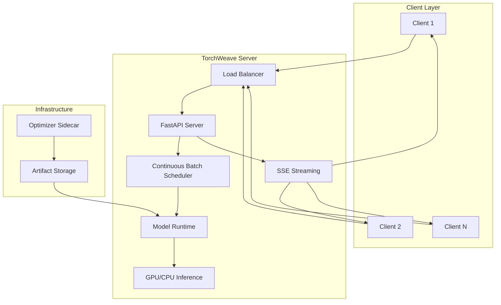

A high-performance distributed LLM inference server featuring continuous batching, dynamic model management, KV-cache optimization, and real-time streaming capabilities.

## Features

### Core Performance
- **Continuous Batching**: Efficient request processing with dynamic batching
- **KV-Cache Optimization**: Per-request cache management for memory efficiency
- **Dynamic Model Loading**: Runtime model management with HuggingFace Hub integration
- **Real-time Streaming**: Server-Sent Events (SSE) for token-by-token delivery

### Infrastructure
- **Microservices Architecture**: Containerized services with Docker Compose
- **Redis Integration**: Distributed caching and session management  
- **Model Manager**: Dedicated service for model lifecycle management
- **Web Interface**: Interactive UI for model interaction and management

### Developer Experience
- **REST API**: OpenAPI/Swagger documentation
- **Health Monitoring**: Comprehensive health checks and status endpoints
- **CI/CD Pipeline**: GitHub Actions for automated testing and deployment

## Architecture

```
┌─────────────────┐    ┌─────────────────┐    ┌─────────────────┐
│   Web UI        │    │  Main Server    │    │ Model Manager   │
│   (Port 3000)   │◄──►│  (Port 8000)    │◄──►│  (Port 8001)    │
└─────────────────┘    └─────────────────┘    └─────────────────┘
                                │
                                ▼
                       ┌─────────────────┐
                       │  Redis Cache    │
                       │  (Port 6379)    │
                       └─────────────────┘
```

##  Quick Start

### Prerequisites
- Docker & Docker Compose
- Python 3.12+ (for local development)
- CUDA-compatible GPU (recommended)

### Using Docker (Recommended)

1. **Clone the repository**
   ```bash
   git clone https://github.com/sriharshamudumba/TorchWeave_LLM.git
   cd TorchWeave_LLM
   ```

2. **Start all services**
   ```bash
   docker-compose up -d
   ```

3. **Verify deployment**
   ```bash
   docker-compose ps
   ```

### Access Points
- **Web Interface**: http://localhost:3000
- **Main API**: http://localhost:8000
- **Model Manager**: http://localhost:8001
- **API Documentation**: http://localhost:8000/docs

##  API Usage

### Load a Model
```bash
curl -X POST http://localhost:8001/models/load \
  -H "Content-Type: application/json" \
  -d '{"model_id": "microsoft/DialoGPT-medium"}'
```

### Generate Text
```bash
curl -X POST http://localhost:8000/generate \
  -H "Content-Type: application/json" \
  -d '{
    "prompt": "Hello, how are you?",
    "max_length": 50,
    "temperature": 0.7
  }'
```

### Stream Responses (SSE)
```bash
curl -N http://localhost:8000/stream \
  -H "Accept: text/event-stream" \
  -d '{"prompt": "Tell me a story", "max_length": 100}'
```

### Search HuggingFace Models
```bash
curl http://localhost:8001/models/search/llama?limit=5
```

##  Service Details

### Main Server (`server/`)
- **FastAPI application** handling inference requests
- **Continuous batching** for optimal throughput
- **SSE streaming** for real-time token delivery
- **KV-cache management** for memory efficiency

### Model Manager (`model-manager/`)
- **Dynamic model loading** from HuggingFace Hub
- **Model lifecycle management** (load, unload, monitor)
- **Health monitoring** and progress tracking
- **Model search** and discovery

### Web Interface (`ui/`)
- **Interactive chat interface** for model testing
- **Model management dashboard** 
- **Real-time streaming** visualization
- **System monitoring** and health checks

### Optimizer Service
- **Model optimization** techniques
- **Performance profiling** and metrics
- **Resource utilization** monitoring

##  Development

### Local Setup
```bash
# Create virtual environment
python -m venv llm_env
source llm_env/bin/activate

# Install dependencies
pip install -r requirements.txt

# Run individual services
python -m src.server
python -m src.model_manager
```

### Running Tests
```bash
pytest tests/
```

### Code Quality
```bash
# Format code
black src/
isort src/

# Type checking
mypy src/

# Linting
flake8 src/
```

## Performance Features

### Continuous Batching
- Dynamic request batching for maximum GPU utilization
- Per-request KV-cache management
- Adaptive batch sizing based on model capacity

### Memory Optimization
- Efficient attention mechanism implementation
- KV-cache pruning and management
- Memory-mapped model loading

### Streaming Capabilities
- Real-time token delivery via SSE
- Time-to-first-token optimization
- Configurable streaming parameters

##  Monitoring

### Health Endpoints
- **Server Health**: `GET /health`
- **Model Manager Health**: `GET http://localhost:8001/health`
- **System Status**: `GET http://localhost:8001/status`

### Metrics & Logging
- Request/response latency tracking
- Token generation speed monitoring
- Resource utilization metrics
- Comprehensive logging with structured format

## Contributing

1. Fork the repository
2. Create a feature branch (`git checkout -b feature/amazing-feature`)
3. Commit your changes (`git commit -m 'Add amazing feature'`)
4. Push to the branch (`git push origin feature/amazing-feature`)
5. Open a Pull Request

##  License

This project is licensed under the MIT License - see the [LICENSE](LICENSE) file for details.

##  Acknowledgments

- **HuggingFace Transformers** for model implementations
- **FastAPI** for the web framework
- **PyTorch** for deep learning capabilities
- **Redis** for caching and session management

##  Support

- **Documentation**: Check the `/docs` endpoints for API documentation
- **Issues**: Report bugs via GitHub Issues
- **Discussions**: Join project discussions for feature requests
>>>>>>> 7a613761b619fc3d69e7e520aefae625c3e3f189

A high-performance LLM inference server implementing continuous batching, per-request KV-cache management, and Server-Sent Events (SSE) streaming. Designed for production-scale deployment with **2-5x throughput improvements** under concurrent load.

<<<<<<< HEAD
##  Key Features

- **Continuous Batching**: Merges concurrent requests into shared decode steps for maximum GPU utilization
- **Per-Request KV-Cache**: Individual memory management with attention masks for variable sequence lengths
- **SSE Token Streaming**: Real-time token delivery with time-to-first-token (TTFT) metrics
- **CUDA Acceleration**: Automatic GPU detection with CPU fallback
- **Container-Native**: Docker Compose orchestration with optimizer sidecar
- **Production-Ready**: ECS/Kubernetes-friendly architecture with shared artifact storage

##  Performance Benchmarks

| Configuration | Tokens/sec | TTFT (avg) | Throughput Gain |
|--------------|------------|------------|-----------------|
| Continuous Batching (4 concurrent) | 3.52 | 0.860s | **98% improvement** |
| Baseline (4 concurrent) | 1.78 | N/A | Baseline |
| Sequential Processing | 3.09 | N/A | Reference |

*Benchmarked on TinyLlama-1.1B with CPU inference*

##  Architecture



##  Technology Stack

- **Backend**: Python 3.12, FastAPI, Uvicorn
- **ML Framework**: PyTorch, Hugging Face Transformers
- **Inference**: Custom continuous batching scheduler
- **Streaming**: Server-Sent Events (SSE)
- **Containerization**: Docker, Docker Compose
- **Orchestration**: ECS/Kubernetes ready
- **Monitoring**: Built-in TTFT metrics, request logging

##  Project Structure

```
TorchWeave_LLM/
├── .github/workflows/          # CI/CD pipelines
│   ├── ci.yml                 # Continuous integration
│   └── benchmark.yml          # Performance testing
├── server/                    # Core inference server
│   ├── Dockerfile
│   ├── requirements.txt
│   └── src/
│       ├── server.py          # FastAPI application
│       ├── scheduler.py       # Continuous batching logic
│       └── model_runtime.py   # PyTorch model interface
├── optimizer/                 # Model artifact staging
│   ├── Dockerfile
│   └── src/optimizer.py
├── scripts/
│   └── bench.py              # Performance benchmarking
├── docker-compose.yml        # Orchestration configuration
└── .env.example              # Environment template
```

##  Quick Start

### Prerequisites

- Docker 27+ with Compose v2
- (Optional) NVIDIA Container Toolkit for GPU acceleration

### 1. Clone and Configure

```bash
git clone https://github.com/sriharshamudumba/TorchWeave_LLM.git
cd TorchWeave_LLM
cp .env.example .env
```

### 2. Start Services

```bash
# CPU inference
docker compose up -d --build

# GPU inference (if NVIDIA toolkit installed)
docker compose --profile gpu up -d --build
```

### 3. Verify Health

```bash
curl http://localhost:8000/health
curl http://localhost:8000/model
```

### 4. Test Generation

```bash
# Streaming with continuous batching
curl -N -X POST http://localhost:8000/v1/generate \
  -H 'Content-Type: application/json' \
  -d '{"prompt":"Explain quantum computing","max_new_tokens":64}'

# Baseline comparison
curl -X POST http://localhost:8000/v1/generate_nobatch \
  -H 'Content-Type: application/json' \
  -d '{"prompt":"Explain quantum computing","max_new_tokens":64}'
```

##  API Reference

### Core Endpoints

#### `GET /health`
Health check endpoint

**Response:**
```json
{"status": "ok"}
```

#### `GET /model`
Model information and capabilities

**Response:**
```json
{
  "vocab_size": 32000,
  "eos": "</s>",
  "device": "cuda:0",
  "max_batch_size": 16
}
```

#### `POST /v1/generate`
Streaming generation with continuous batching

**Request:**
```bash
curl -N -X POST http://localhost:8000/v1/generate \
  -H 'Content-Type: application/json' \
  -d '{
    "prompt": "Your prompt here",
    "max_new_tokens": 128,
    "temperature": 0.7,
    "top_k": 50,
    "top_p": 0.9,
    "seed": 42
  }'
```

**Response:** Server-Sent Events stream
```
event: ttft
data: 0.856

data: Hello
data:  world
data: !

event: done
data: 
```

#### `POST /v1/generate_nobatch`
Baseline generation without batching

**Request:**
```json
{
  "prompt": "Your prompt here",
  "max_new_tokens": 128,
  "temperature": 0.7
}
```

**Response:**
```json
{"text": "Generated response text"}
```

##  Configuration

### Environment Variables

```bash
# Model Configuration
HF_MODEL=TinyLlama/TinyLlama-1.1B-Chat-v1.0
MAX_NEW_TOKENS=128
TEMPERATURE=0.7
TOP_K=50
TOP_P=0.9
SEED=42

# Scheduler Configuration
SCHEDULE_TICK_MS=15          # Lower = better TTFT
MAX_BATCH=16                 # Higher = better throughput

# Storage Configuration
ARTIFACT_DIR=/artifacts
ARTIFACT_MODEL_DIR=/artifacts/model
```

### Performance Tuning

- **Lower TTFT**: Decrease `SCHEDULE_TICK_MS` (10-15ms recommended)
- **Higher Throughput**: Increase `MAX_BATCH` (GPU memory permitting)
- **Memory Optimization**: Use smaller models or reduce batch size
- **GPU Utilization**: Enable CUDA with appropriate batch sizes

##  Benchmarking

Run performance comparisons:

```bash
# Install benchmarking dependencies
pip install httpx

# Test continuous batching under load
python scripts/bench.py --concurrency 8 --iters 24 --sse http://localhost:8000/v1/generate

# Compare with baseline
python scripts/bench.py --concurrency 1 --iters 24 --nobatch http://localhost:8000/v1/generate_nobatch
```

**Benchmark Metrics:**
- **TTFT**: Time to first token (latency)
- **Tokens/sec**: Aggregate throughput
- **Request time**: End-to-end request duration
- **Concurrency impact**: Performance under load

##  Branch Structure

This repository uses feature branches to demonstrate specific technical implementations:

- `feature/continuous-batching` - Async scheduler with request merging
- `feature/kv-cache-optimization` - Per-request memory management
- `feature/sse-streaming` - Real-time token streaming
- `feature/model-runtime` - PyTorch inference engine
- `feature/docker-deployment` - Container orchestration
- `feature/performance-benchmarking` - Testing framework
- `integration/complete-system` - Full system integration
- `release/v1.0.0` - Production release

##  Deployment

### Local Development

```bash
docker compose up -d --build
docker compose logs -f server
```

### Production (ECS/Kubernetes)

The containerized architecture supports cloud deployment:

```yaml
# kubernetes-deployment.yaml
apiVersion: apps/v1
kind: Deployment
metadata:
  name: torchweave-server
spec:
  replicas: 3
  selector:
    matchLabels:
      app: torchweave-server
  template:
    spec:
      containers:
      - name: server
        image: torchweave-server:latest
        ports:
        - containerPort: 8000
        env:
        - name: MAX_BATCH
          value: "32"
        resources:
          requests:
            nvidia.com/gpu: 1
```

### Scaling Considerations

- **Horizontal**: Multiple server replicas with load balancing
- **Vertical**: Increase `MAX_BATCH` and GPU memory
- **Artifact Storage**: Shared volumes for model consistency
- **Health Checks**: Built-in `/health` endpoint for orchestrators

##  Monitoring & Observability

### Built-in Metrics

- Request-level TTFT tracking
- Batch utilization monitoring
- Token throughput measurement
- Error rate and latency tracking

### Logging

```bash
# Server logs
docker compose logs -f server

# Scheduler activity
docker compose logs server | grep "\[Scheduler\]"

# Performance metrics
docker compose logs server | grep "TTFT\|tokens/sec"
```

## Troubleshooting

### Common Issues

#### Model Loading Fails

```bash
# Check optimizer completion
docker compose logs optimizer | tail -5

# Verify artifacts
docker compose exec server ls -la /artifacts/model/
```

#### High TTFT

```bash
# Reduce scheduler tick interval
SCHEDULE_TICK_MS=10 docker compose restart server
```

#### GPU Not Detected

```bash
# Verify NVIDIA runtime
docker run --rm --gpus all nvidia/cuda:12.1.1-base-ubuntu22.04 nvidia-smi

# Check compose GPU configuration
docker compose config | grep -A5 gpu
```

#### Memory Issues

```bash
# Reduce batch size
MAX_BATCH=8 docker compose restart server

# Monitor memory usage
docker stats torchweave_llm_server-server-1
```

##  Contributing

1. Fork the repository
2. Create a feature branch (`git checkout -b feature/amazing-feature`)
3. Commit your changes (`git commit -m 'Add amazing feature'`)
4. Push to the branch (`git push origin feature/amazing-feature`)
5. Open a Pull Request

##  License

This project is licensed under the MIT License - see the [LICENSE](LICENSE) file for details.

##  Acknowledgments

- [Hugging Face Transformers](https://github.com/huggingface/transformers) for model infrastructure
- [FastAPI](https://fastapi.tiangolo.com/) for high-performance web framework
- [PyTorch](https://pytorch.org/) for deep learning capabilities
- [Docker](https://www.docker.com/) for containerization platform

---

**Built by Sri Harsha Mudumba** | *Inference Compiler for LLM Optimization*
=======
**Built  for high-performance LLM inference**
>>>>>>> 7a613761b619fc3d69e7e520aefae625c3e3f189
