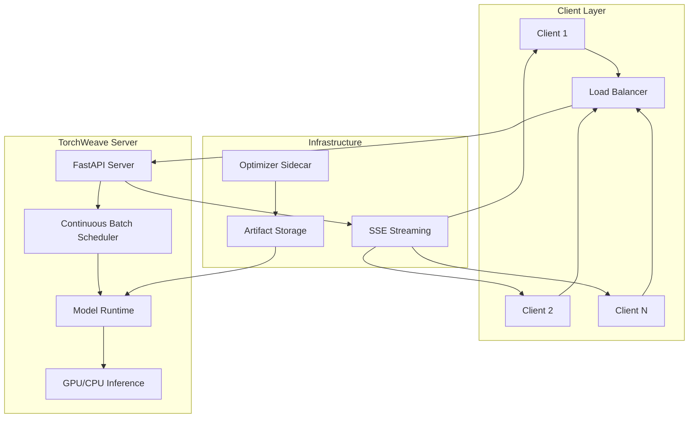

# TorchWeave LLM: Inference Compiler for LLM Optimization

[](https://github.com/sriharshamudumba/TorchWeave_LLM/actions/workflows/ci.yml)
[](https://www.python.org/downloads/release/python-312/)
[](https://docs.docker.com/compose/)
[](https://fastapi.tiangolo.com/)
[](https://pytorch.org/)

A high-performance LLM inference server implementing continuous batching, per-request KV-cache management, and Server-Sent Events (SSE) streaming. Designed for production-scale deployment with 2-5x throughput improvements under concurrent load.

## 🚀 Key Features

- **Continuous Batching**: Merges concurrent requests into shared decode steps for maximum GPU utilization
- **Per-Request KV-Cache**: Individual memory management with attention masks for variable sequence lengths
- **SSE Token Streaming**: Real-time token delivery with time-to-first-token (TTFT) metrics
- **CUDA Acceleration**: Automatic GPU detection with CPU fallback
- **Container-Native**: Docker Compose orchestration with optimizer sidecar
- **Production-Ready**: ECS/Kubernetes-friendly architecture with shared artifact storage

## 📊 Performance Benchmarks

| Configuration | Tokens/sec | TTFT (avg) | Throughput Gain |
|--------------|------------|------------|-----------------|
| Continuous Batching (4 concurrent) | 3.52 | 0.860s | **98% improvement** |
| Baseline (4 concurrent) | 1.78 | N/A | Baseline |
| Sequential Processing | 3.09 | N/A | Reference |

*Benchmarked on TinyLlama-1.1B with CPU inference*

## 🏗️ Architecture



## 🛠️ Technology Stack

- **Backend**: Python 3.12, FastAPI, Uvicorn
- **ML Framework**: PyTorch, Hugging Face Transformers
- **Inference**: Custom continuous batching scheduler
- **Streaming**: Server-Sent Events (SSE)
- **Containerization**: Docker, Docker Compose
- **Orchestration**: ECS/Kubernetes ready
- **Monitoring**: Built-in TTFT metrics, request logging

## 📂 Project Structure

```
TorchWeave_LLM/
├── .github/workflows/          # CI/CD pipelines
│   ├── ci.yml                 # Continuous integration
│   └── benchmark.yml          # Performance testing
├── server/                    # Core inference server
│   ├── Dockerfile
│   ├── requirements.txt
│   └── src/
│       ├── server.py          # FastAPI application
│       ├── scheduler.py       # Continuous batching logic
│       └── model_runtime.py   # PyTorch model interface
├── optimizer/                 # Model artifact staging
│   ├── Dockerfile
│   └── src/optimizer.py
├── scripts/
│   └── bench.py              # Performance benchmarking
├── docker-compose.yml        # Orchestration configuration
└── .env.example              # Environment template
```

## 🚦 Quick Start

### Prerequisites
- Docker 27+ with Compose v2
- (Optional) NVIDIA Container Toolkit for GPU acceleration

### 1. Clone and Configure
```bash
git clone https://github.com/sriharshamudumba/TorchWeave_LLM.git
cd TorchWeave_LLM
cp .env.example .env
```

### 2. Start Services
```bash
# CPU inference
docker compose up -d --build

# GPU inference (if NVIDIA toolkit installed)
docker compose --profile gpu up -d --build
```

### 3. Verify Health
```bash
curl http://localhost:8000/health
curl http://localhost:8000/model
```

### 4. Test Generation
```bash
# Streaming with continuous batching
curl -N -X POST http://localhost:8000/v1/generate \
  -H 'Content-Type: application/json' \
  -d '{"prompt":"Explain quantum computing","max_new_tokens":64}'

# Baseline comparison
curl -X POST http://localhost:8000/v1/generate_nobatch \
  -H 'Content-Type: application/json' \
  -d '{"prompt":"Explain quantum computing","max_new_tokens":64}'
```

## 📡 API Reference

### Core Endpoints

#### `GET /health`
Health check endpoint
```json
{"status": "ok"}
```

#### `GET /model`
Model information and capabilities
```json
{
  "vocab_size": 32000,
  "eos": "</s>",
  "device": "cuda:0",
  "max_batch_size": 16
}
```

#### `POST /v1/generate`
Streaming generation with continuous batching
```bash
curl -N -X POST http://localhost:8000/v1/generate \
  -H 'Content-Type: application/json' \
  -d '{
    "prompt": "Your prompt here",
    "max_new_tokens": 128,
    "temperature": 0.7,
    "top_k": 50,
    "top_p": 0.9,
    "seed": 42
  }'
```

**Response**: Server-Sent Events stream
```
event: ttft
data: 0.856

data: Hello
data:  world
data: !

event: done
data: 
```

#### `POST /v1/generate_nobatch`
Baseline generation without batching
```json
{
  "prompt": "Your prompt here",
  "max_new_tokens": 128,
  "temperature": 0.7
}
```

**Response**:
```json
{"text": "Generated response text"}
```

## ⚙️ Configuration

### Environment Variables
```bash
# Model Configuration
HF_MODEL=TinyLlama/TinyLlama-1.1B-Chat-v1.0
MAX_NEW_TOKENS=128
TEMPERATURE=0.7
TOP_K=50
TOP_P=0.9
SEED=42

# Scheduler Configuration
SCHEDULE_TICK_MS=15          # Lower = better TTFT
MAX_BATCH=16                 # Higher = better throughput

# Storage Configuration
ARTIFACT_DIR=/artifacts
ARTIFACT_MODEL_DIR=/artifacts/model
```

### Performance Tuning

- **Lower TTFT**: Decrease `SCHEDULE_TICK_MS` (10-15ms recommended)
- **Higher Throughput**: Increase `MAX_BATCH` (GPU memory permitting)
- **Memory Optimization**: Use smaller models or reduce batch size
- **GPU Utilization**: Enable CUDA with appropriate batch sizes

## 🧪 Benchmarking

Run performance comparisons:

```bash
# Install benchmarking dependencies
pip install httpx

# Test continuous batching under load
python scripts/bench.py --concurrency 8 --iters 24 --sse http://localhost:8000/v1/generate

# Compare with baseline
python scripts/bench.py --concurrency 1 --iters 24 --nobatch http://localhost:8000/v1/generate_nobatch
```

**Benchmark Metrics**:
- **TTFT**: Time to first token (latency)
- **Tokens/sec**: Aggregate throughput
- **Request time**: End-to-end request duration
- **Concurrency impact**: Performance under load

## 🏷️ Branch Structure

This repository uses feature branches to demonstrate specific technical implementations:

- [`feature/continuous-batching`](../../tree/feature/continuous-batching) - Async scheduler with request merging
- [`feature/kv-cache-optimization`](../../tree/feature/kv-cache-optimization) - Per-request memory management
- [`feature/sse-streaming`](../../tree/feature/sse-streaming) - Real-time token streaming
- [`feature/model-runtime`](../../tree/feature/model-runtime) - PyTorch inference engine
- [`feature/docker-deployment`](../../tree/feature/docker-deployment) - Container orchestration
- [`feature/performance-benchmarking`](../../tree/feature/performance-benchmarking) - Testing framework
- [`integration/complete-system`](../../tree/integration/complete-system) - Full system integration
- [`release/v1.0.0`](../../tree/release/v1.0.0) - Production release

## 🐳 Deployment

### Local Development
```bash
docker compose up -d --build
docker compose logs -f server
```

### Production (ECS/Kubernetes)
The containerized architecture supports cloud deployment:

```yaml
# kubernetes-deployment.yaml
apiVersion: apps/v1
kind: Deployment
metadata:
  name: torchweave-server
spec:
  replicas: 3
  selector:
    matchLabels:
      app: torchweave-server
  template:
    spec:
      containers:
      - name: server
        image: torchweave-server:latest
        ports:
        - containerPort: 8000
        env:
        - name: MAX_BATCH
          value: "32"
        resources:
          requests:
            nvidia.com/gpu: 1
```

### Scaling Considerations
- **Horizontal**: Multiple server replicas with load balancing
- **Vertical**: Increase `MAX_BATCH` and GPU memory
- **Artifact Storage**: Shared volumes for model consistency
- **Health Checks**: Built-in `/health` endpoint for orchestrators

## 🛡️ Monitoring & Observability

### Built-in Metrics
- Request-level TTFT tracking
- Batch utilization monitoring  
- Token throughput measurement
- Error rate and latency tracking

### Logging
```bash
# Server logs
docker compose logs -f server

# Scheduler activity
docker compose logs server | grep "\[Scheduler\]"

# Performance metrics
docker compose logs server | grep "TTFT\|tokens/sec"
```

## 🔧 Troubleshooting

### Common Issues

**Model Loading Fails**
```bash
# Check optimizer completion
docker compose logs optimizer | tail -5

# Verify artifacts
docker compose exec server ls -la /artifacts/model/
```

**High TTFT**
```bash
# Reduce scheduler tick interval
SCHEDULE_TICK_MS=10 docker compose restart server
```

**GPU Not Detected**
```bash
# Verify NVIDIA runtime
docker run --rm --gpus all nvidia/cuda:12.1.1-base-ubuntu22.04 nvidia-smi

# Check compose GPU configuration
docker compose config | grep -A5 gpu
```

**Memory Issues**
```bash
# Reduce batch size
MAX_BATCH=8 docker compose restart server

# Monitor memory usage
docker stats torchweave_llm_server-server-1
```

## 🤝 Contributing

1. Fork the repository
2. Create a feature branch (`git checkout -b feature/amazing-feature`)
3. Commit your changes (`git commit -m 'Add amazing feature'`)
4. Push to the branch (`git push origin feature/amazing-feature`)
5. Open a Pull Request

## 📄 License

This project is licensed under the MIT License - see the [LICENSE](LICENSE) file for details.

## 🙏 Acknowledgments

- Hugging Face Transformers for model infrastructure
- FastAPI for high-performance web framework
- PyTorch for deep learning capabilities
- Docker for containerization platform

---

**Built by [Sri Harsha Mudumba](https://github.com/sriharshamudumba)** | Inference Compiler for LLM Optimization
